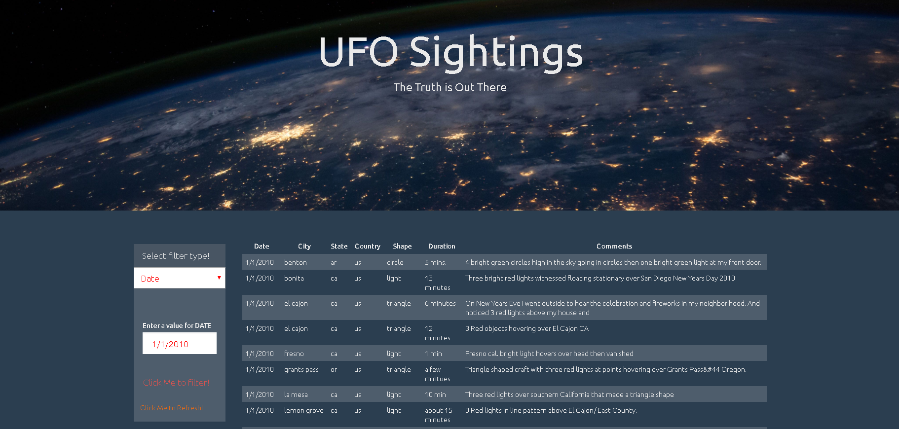
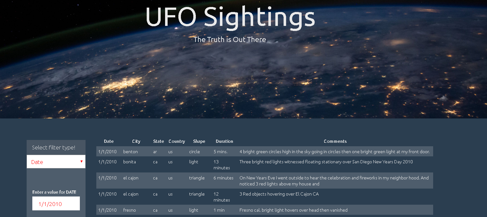
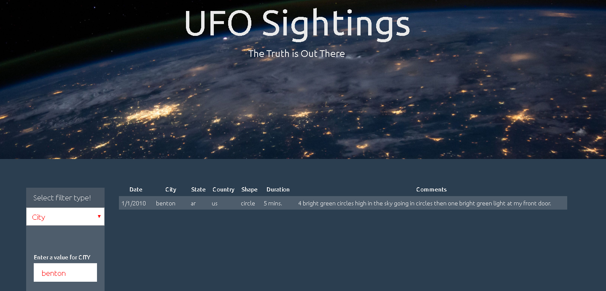
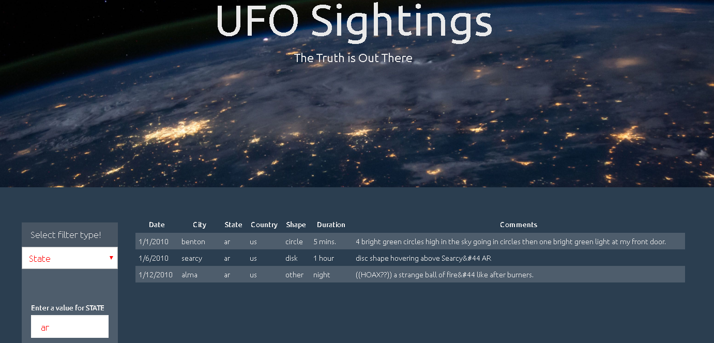
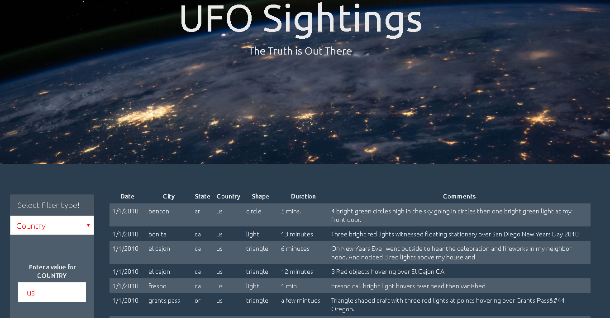
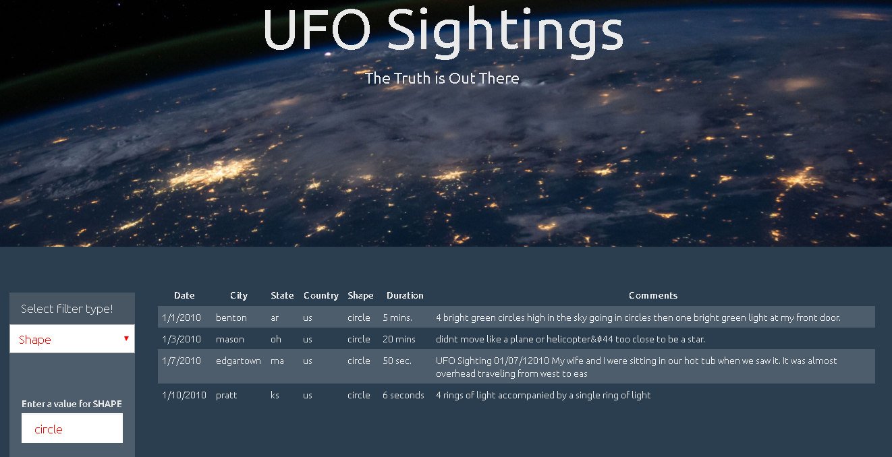

# JavaScript and DOM Manipulation

## Background

WAKE UP SHEEPLE! The extra-terrestrial menace has come to Earth and we here at `ALIENS-R-REAL` have collected all of the eye-witness reports we could to prove it! All we need to do now is put this information online for the world to see and then the matter will finally be put to rest.

In this challenge, I have written a code using JavaScript, HTML, CSS, and D3.js, that will create a table dynamically based upon a [dataset provided](static/js/data.js). Also users are allowed to filter the table data for specific values. 

## Tasks

### Level 1: Automatic Table and Date Search

* Create a basic HTML web page.[index.html](index.html).

* Using the UFO dataset provided in the form of an array of JavaScript objects, write code that appends a table to your web page and then adds new rows of data for each UFO sighting.

  * Make sure you have a column for `date/time`, `city`, `state`, `country`, `shape`, and `comment` at the very least.

  

* [JavaScript code](static/js/app.js) that will listen for events and search through the `date/time` column to find rows that match user input.

### Level 2: Multiple Search Categories

* Using multiple `input` tags and/or select dropdowns, write JavaScript code so the user can to set multiple filters and search for UFO sightings using the following criteria based on the table columns:

  1. `date/time`

  

  2. `city`

  

  3. `state`

  

  4. `country`

  

  5. `shape`

  

